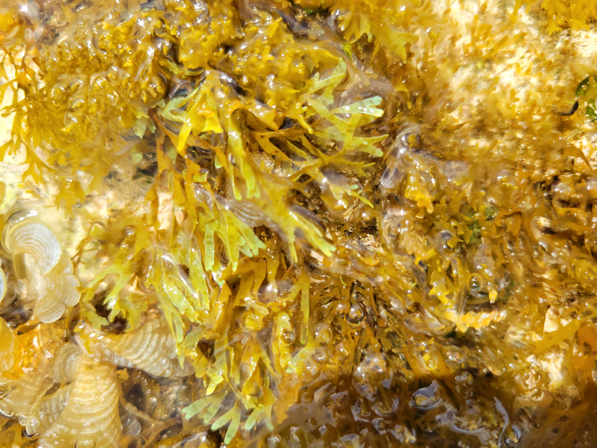
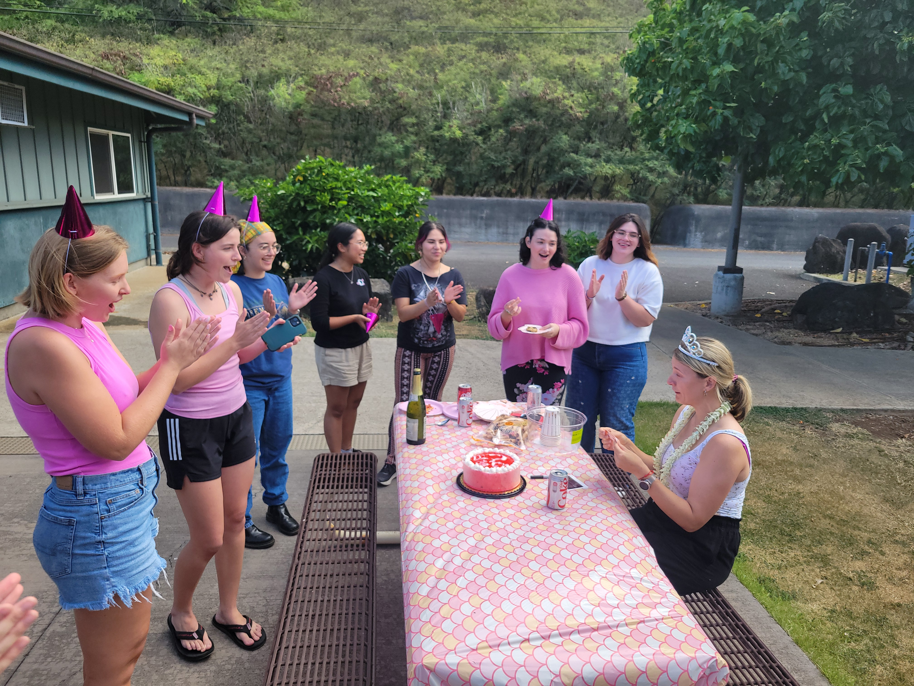
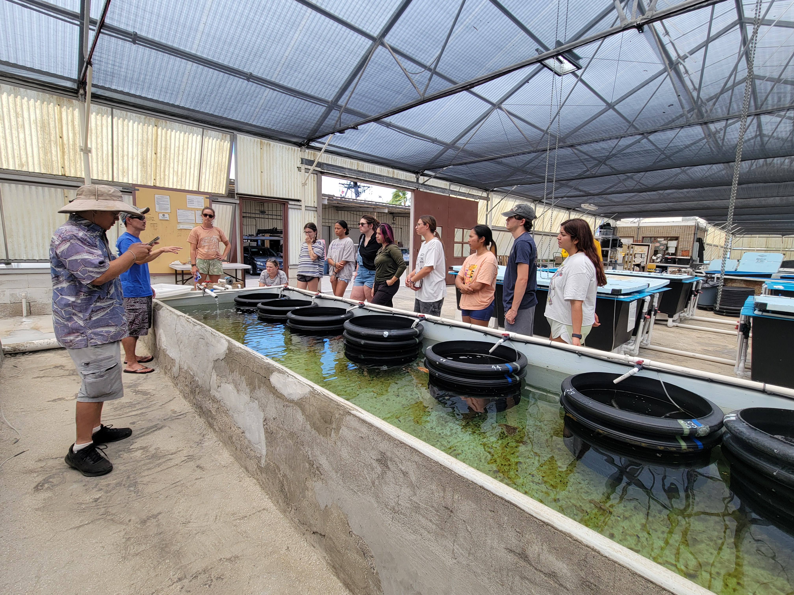
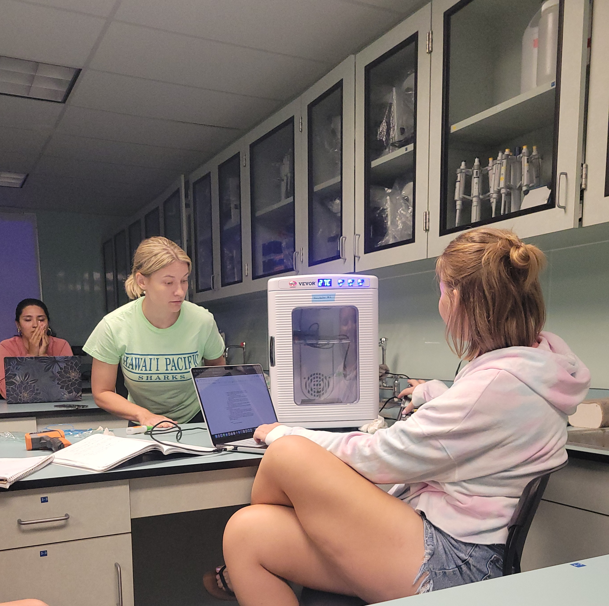
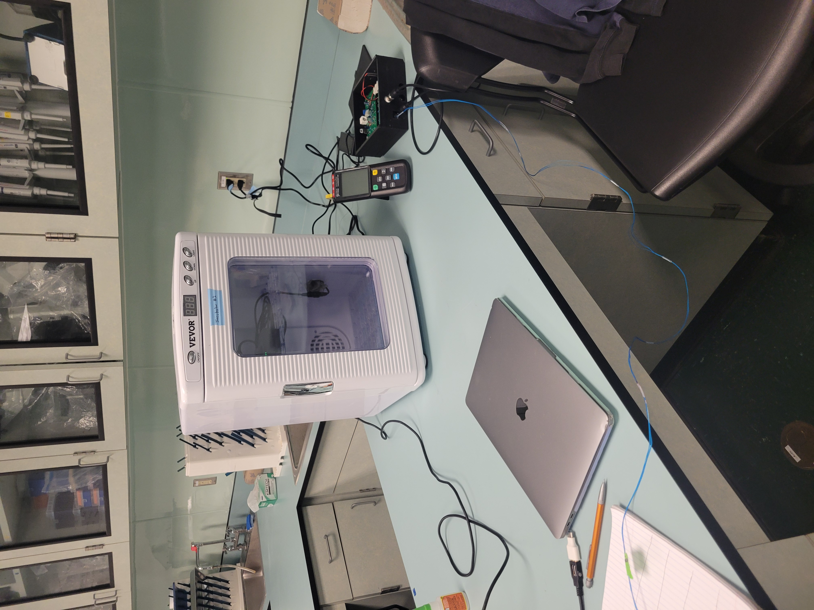

```{=html}
<style>
  {
  box-sizing: border-box;
}


/* Left column */
.leftcolumn {
  float: left;
  width: 100%;
}

.leftcolumn a {
  text-decoration: none;
}

.leftcolumn h2 {
  margin-bottom:-1rem;
}

.gallery {
  display: grid;
  grid-template-columns: repeat(auto-fit, minmax(15rem, 1fr));
  grid-auto-rows: 15rem;
  grid-auto-flow: dense;
  gap: 1rem;
  margin-top: 1.5rem;
}

.gallery item {
  container: figure / inline-size;
  overflow: hidden;
  display: grid;
  grid-template-columns: minmax(0, 1fr);
  grid-template-rows: minmax(0, 1fr);
}

.gallery img {
  inline-size: 100%;
  block-size: 100%;
  object-fit: cover;
  grid-area: 1 / 1 / -1 / -1;
  transition: scale 1s ease-in-out;
}

button{
  border:none;
  border-radius:5px;
  margin-top: 0.3rem;
  padding:13px 35px;
  font-size: 1rem;
  cursor:pointer;
  background-color:#333;
  font-weight: normal;
  color:white;
  
}

button:hover{
  background-color:#ddd;
}

.years {
  display: none;
  position: absolute;
  overflow: auto;
  background-color:#fff;
  border-radius:5px;
  box-shadow: 0px 5px 5px 0px rgba(0,0,0,0.2);
}

.navigation:hover .years {
  display: block;
}

.years a {
  display: block;
  color: #000000;
  padding: 5px;
  font-size: 1rem;
  text-decoration: none;
  padding:20px 40px;
}

.years a:hover {
  color: #0a0a23;
  background-color: #ddd;
  border-radius:5px;
}
</style>

<!--information section and page title--> 

<body>
<div class="row">
  <div class="leftcolumn">
    <h2>Lab Photos</h2>
    <hr>
    <div class="gallery">
      <div class="item">
        <a href="images/EwaBeachIntertidaling-Limu01.jpg"></a>
      </div>
      <div class="item">
        <a href="images/EwaBeachIntertidaling-03.jpg"></a>
      </div>
      <div class="item">
        <a href="images/EwaBeachIntertidaling-02.jpg"></a>
      </div>
      <div class="item">
        <a href="images/EwaBeachIntertidaling-01.jpg"></a>
      </div>
      <div class="item">
        <a href="images/IMG_4400.JPG"></a>
      </div>
      <div class="item">
        <a href= "images/20250625_165711.jpg">
      </div>
      <div class="item">
        <a href= "images/20250414_133828.jpg">
      </div><div class="item">
        <a href= "images/20250414_112336.jpg">
      </div>
      <div class="item">
        <a href= "images/20250414_112230.jpg">
      </div>
      <div class="item">
        <a href= "images/20250414_102933.jpg">
      </div>
      <div class="item">
        <a href= "images/20250414_100534.jpg">
      </div>
      <div class="item">
        <a href= "images/20250414_100529.jpg">
      </div>
      <div class="item">
        <a href= "images/20250325_145723.jpg">
      </div>
      <div class="item">
        <a href= "images/20250325_133156.jpg">
      </div>
      <div class="item">
         <a href= "images/20241030_181427.jpg">
      </div>
      <div class="item">
        <a href= "images/AFSpic.jpg">
      </div>
      <div class="item">
        <a href= "images/IMG_2947.jpg">
      </div>
    </div>
  </div>
```
