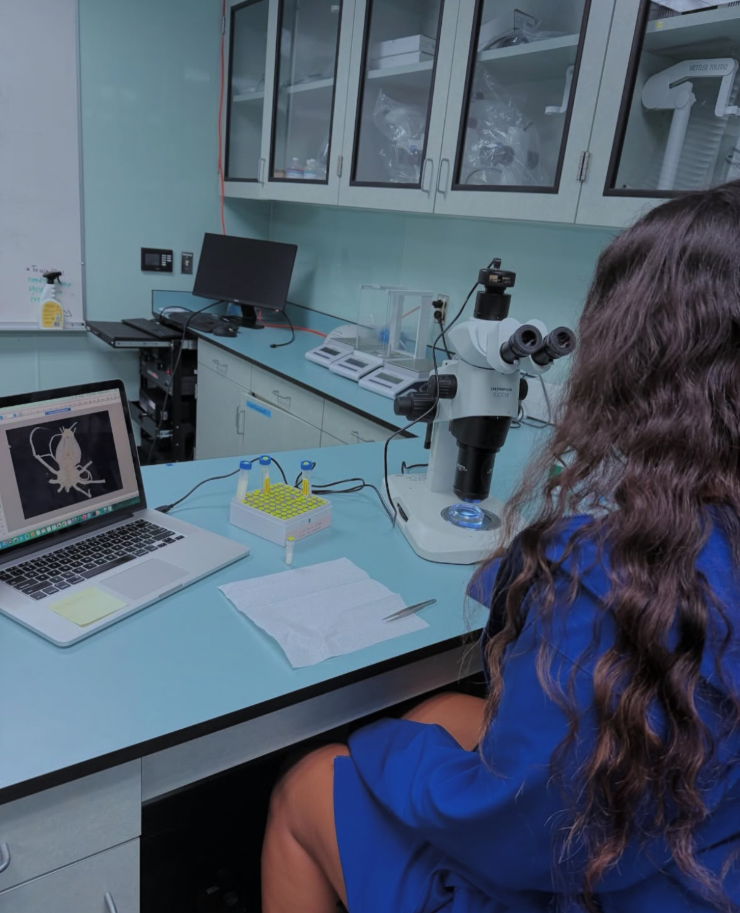
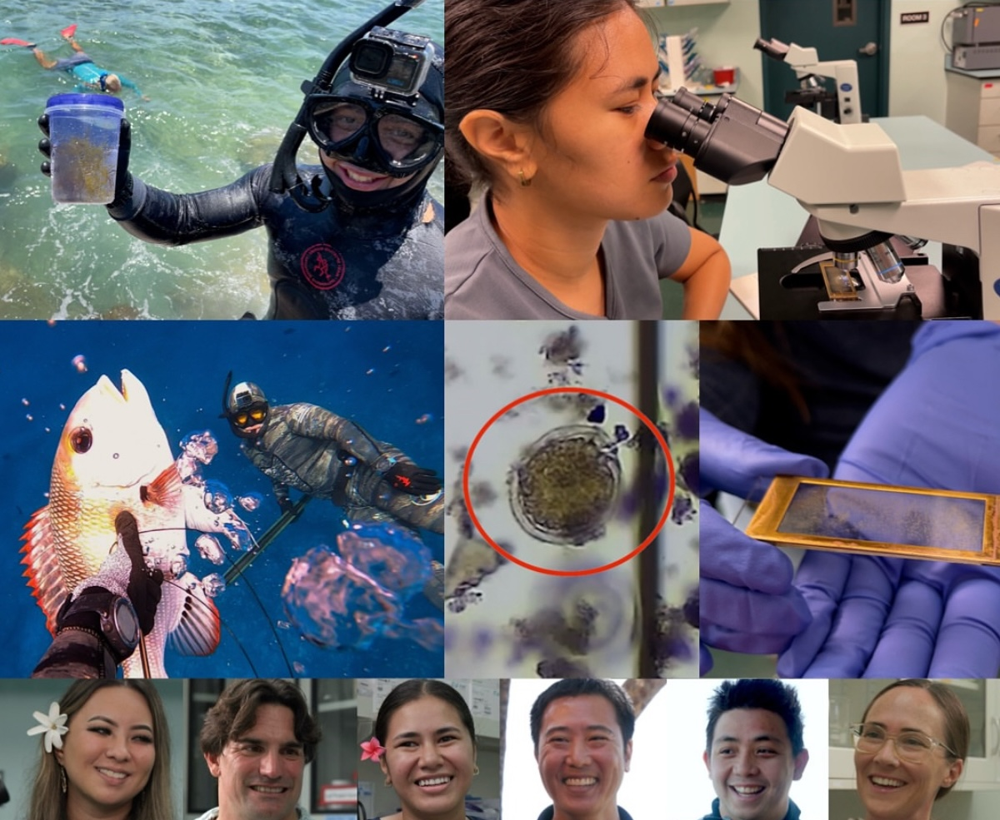
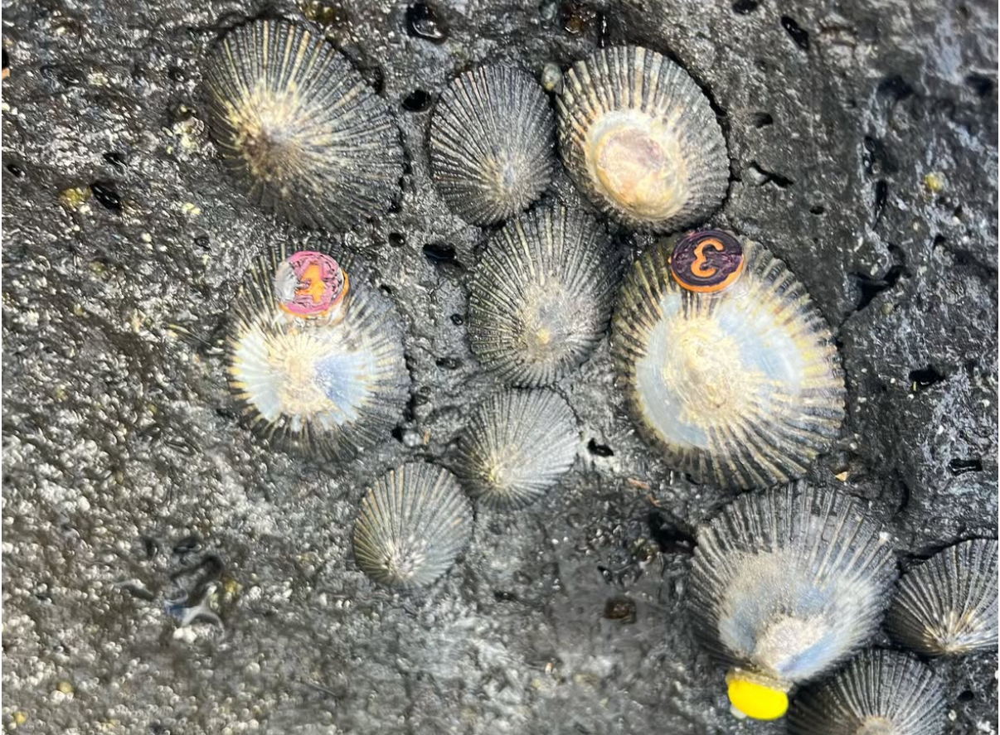
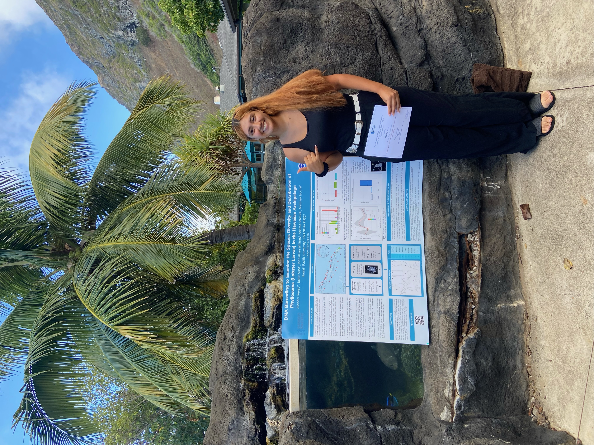

```{=html}
<!-- css formatting for intro section -->
<style>
.intro {
    display: absolute;
    align-items: center;
    text-align: center;
    }
 
.intro h2 {
  font-size: 2rem;
  margin-bottom: -0.8rem;
  }
  
.hr solid {
  border-top: 3px solid #bbb;
  }
  
.intro p {
  margin: 0.5rem;
  }
  
</style>

<!-- html code for intro section -->
<div class="intro">
  <h2>Welcome to the Iacchei Lab</h2>
  <hr class="solid">
  <p> The Iacchei Lab is an academic research laboratory at Hawaii Pacific University. Our lab uses a combination of field and molecular techniques to answer conservation and fisheries questions important to our local community.</p>
</div>
```

```{=html}
<!-- css formatting for links to other pages gallery -->
<style>
 .quicklinks {
  margin: 5px;
  width: 500px;
 }
  
  .quicklinks:hover {
    scale: 105%;
}

  .quicklinks img {
   object-fit: cover;
   object-position: bottom;
   width: 100%;
   height: 20rem;
   border-radius: 2px;
}

  .desc {
   padding: 15px;
   text-align: center;
}
  
</style>


<!-- embedded html code for links to other pages gallery -->
<div class="section" >
  <div class="quicklinks">
    <div class="desc">See what our students are up to <a href="team.qmd">here</a></div>
    <a target="_blank" href="team.qmd">
      
    </a>
  </div>
  
  <div class="quicklinks">
    <div class="desc">See the Iacchei Lab in the news <a href="News.qmd">here</a></div>
    <a target="_blank" href="News.qmd">
      
    </a>
  </div>
  
  <div class="quicklinks">
    <div class="desc">Find out more about our research <a href="Research.qmd">here</a></div>
    <a target="_blank" href="Research.qmd">
      
    </a>
  </div>
</div>
```

</br>

```{=html}
<style>
.section {
  display: flex;              /* Align children side by side */
  align-items: center; 
  margin: 2rem auto;
  gap: 2rem;                  /* Space between image and text */
  }

.section h2 {
  font-size: 2rem;
  margin-bottom: -0.8rem;
  }

.hr solid{
  border-top: 3px solid #bbb;
  }
  

.img_spot {
   min-width: 750px;
   max-height: 550px;
   object-fit: cover;
   object-position: 0px 60%;;
   border-radius: 2px;
}

.subsection {
  display: absolute;
  margin: 1rem;
}

</style>

<div class="section">
  
  <div class ="subsection">
    <h2>August Spotlight</h2>
    <hr class="solid">
    <p> School starts August 25th! Our second year graduate student, <a href=AlondraBio.qmd>Alondra Reyes</a>, presented at the MSMS Student Symposium on August 22nd. </p>
    </div>
</div>
```

## </br>

This is a Quarto website.

To learn more about Quarto websites, visit the [official documentation](https://quarto.org/docs/websites).

\`\`\`{r} 1 + 1
